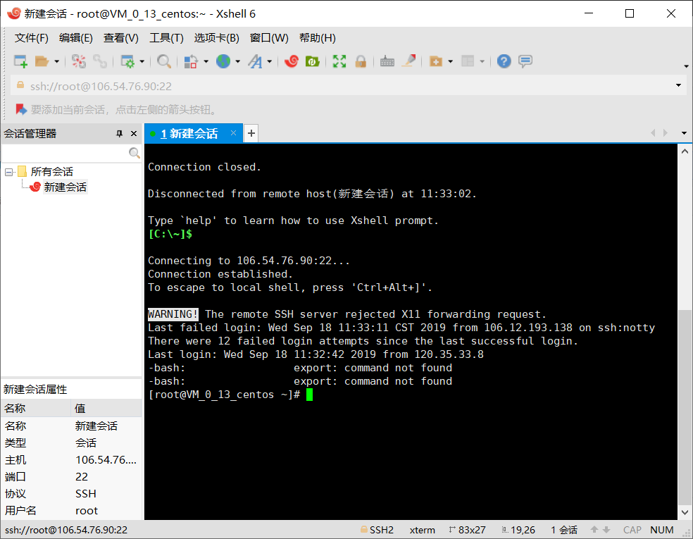
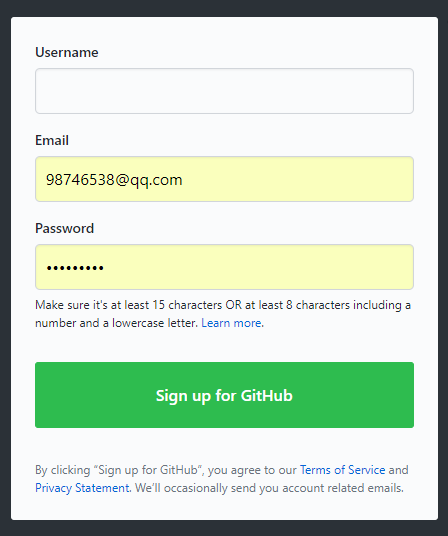
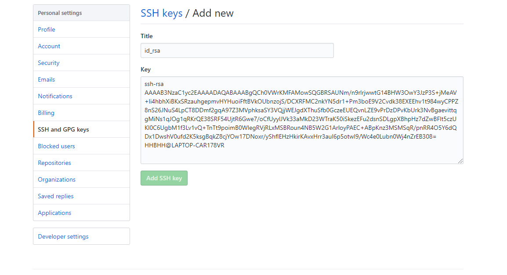
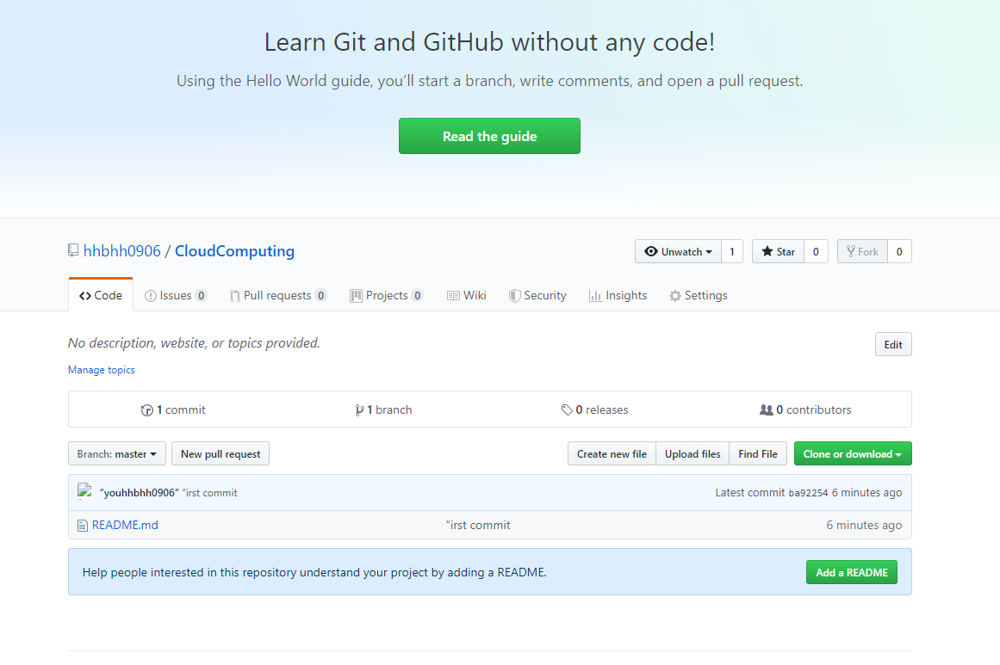
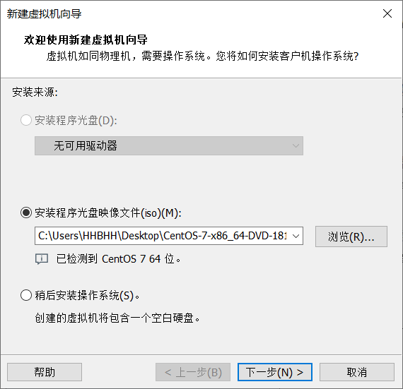
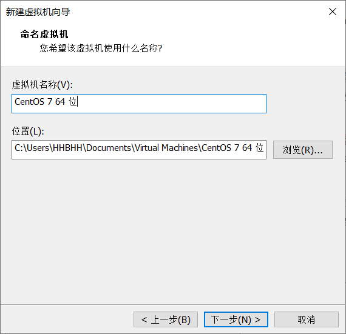
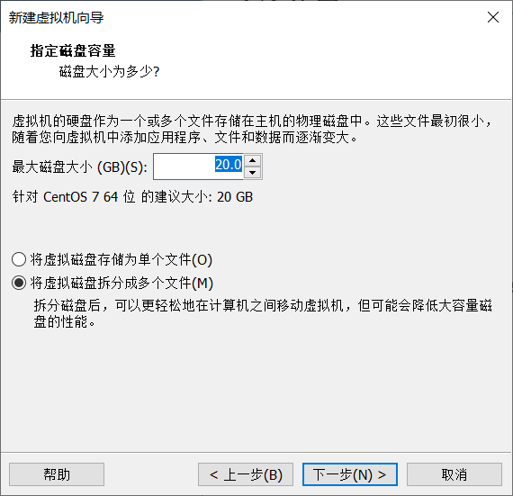
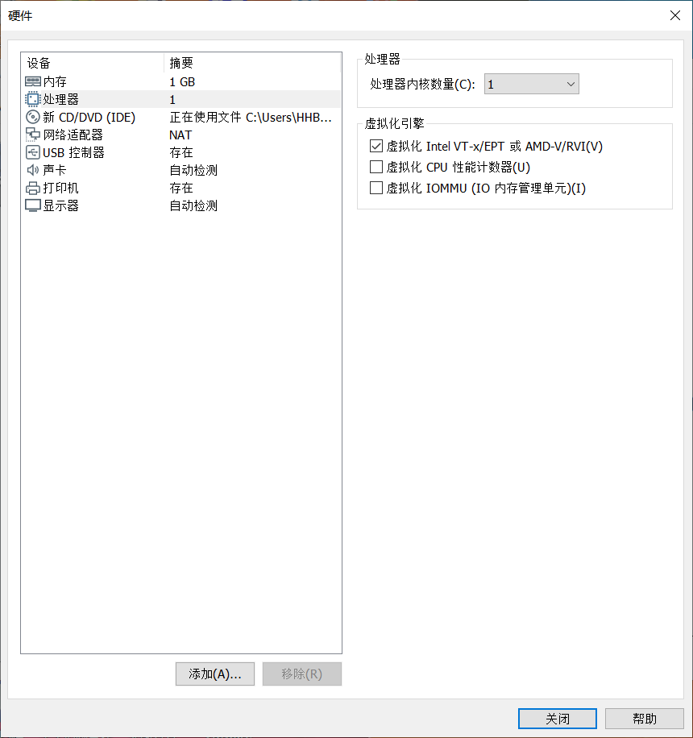
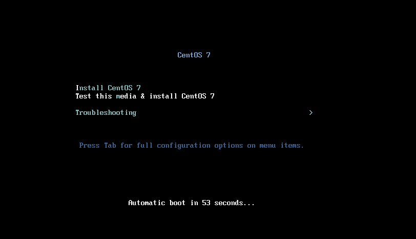
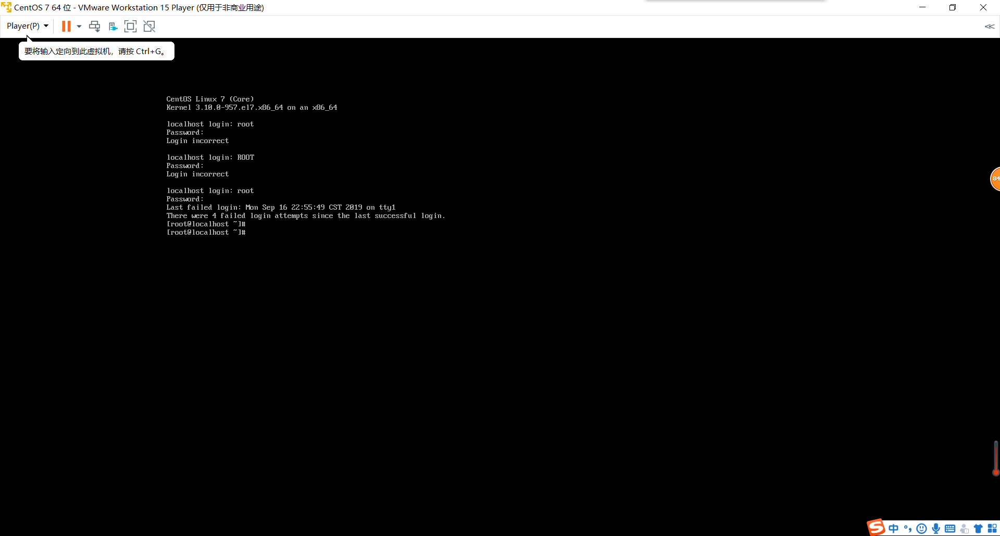

# **实验一 云计算课程基础实验**

### 班级：2017级软件工程（闽台合作）姓名：黄滨 学号：11607207033

### **1.购买腾讯云服务器并登录**

#### 1.1购买腾讯云服务器

#### 1.2使用Web Shell登录已购买的云服务器实例

#### 1.3下载安装Xshell（包含在Xmanager中），并使用Xshell登录腾讯云实例

### **2.创建GitHub项目并在本地同步**

#### 2.1注册GitHub账号

#### 2.2在GitHub上创建云计算项目（CloudComputing）并在本地同步

##### 2.2.1创建SSH Key

##### 2.2.2复制“id_rsa.pub”的内容到GitHub网站的Settings–>SSH and GPG keys中

##### 2.2.3测试SSH Key是否配置成功

##### 2.2.4配置GitHub的用户名和邮箱

##### 2.2.5创建GitHub项目并在本地进行同步，初始化本地文件夹作为一个Git仓库

##### 2.2.6添加远程代码仓库的URL

##### 2.2.7验证一下添加是否成功

##### 2.2.8首先从远程代码仓库拉取数据

##### 2.2.9新建README文档

##### 2.2.10添加文件夹中的所有文件

##### 2.2.11提交文件

##### 2.2.12推送本地更新至远程服务器

### **3.本地安装VMware Workstation和CentOS操作系统**

