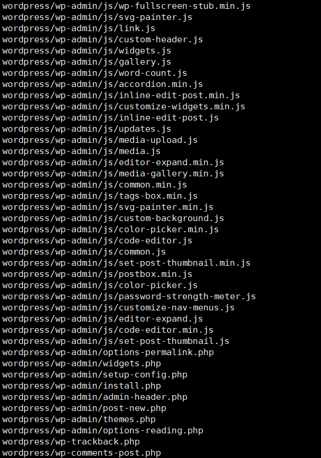
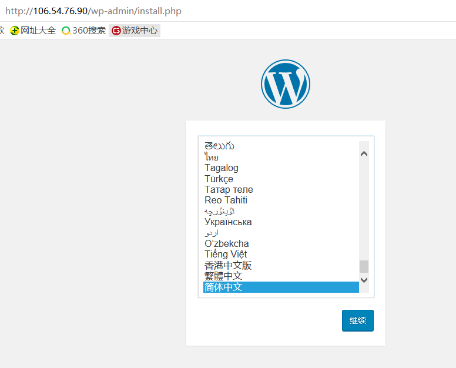

# **实验二 基于云服务器创建个人网站**

### **班级：2017级软件工程（闽台合作）姓名：黄滨 学号：11607207033**

### **1.** **安装Apache Web服务器**

#### 使用yum工具安装

#### 测试Apache服务器是否成功运行

### **2.安装MySQL**

#### 安装MariaDB

#### 随后，运行简单的安全脚本以移除潜在的安全风险，启动交互脚本

#### 设置相应的root访问密码以及相关的设置

#### 设置开机启动MariaDB

#### PHP 7.x包在许多仓库中都包含，这里我们使用Remi仓库，而Remi仓库依赖于EPEL仓库，因此首先启用这两个仓库

#### 启用PHP 7.2 Remi仓库

#### 安装PHP以及php-mysql

#### 查看安装的php版本

#### 重启Apache服务器以支持PHP

### **4.** **安装PHP模块**

#### 为了更好的运行PHP，需要启动PHP附加模块，使用如下命令可以查看可用模块

#### 先行安装php-fpm(PHP FastCGI Process Manager)和php-gd(A module for PHP applications for using the gd graphics library)，WordPress使用php-gd进行图片的缩放

#### 重启Apache服务

### **5****.测试PHP**

#### 创建info.php并将其置于Web服务的根目录

#### 该命令使用vim在/var/www/html/处创建一个空白文件info.php，我们添加如下内容

#### 完成之后，使用刚才获取的cvm的IP地址，在本地主机的浏览器中输入

### **6****.安装WordPress以及完成相关配置**

#### **(1)为WordPress创建一个MySQL数据库**

#### 首先以root用户登录MySQL数据库

#### 为WordPress创建一个新的数据库

#### 接着为WordPress创建一个独立的MySQL用户

#### 授权给wordpressuser用户访问数据库的权限

#### 随后刷新MySQL的权限

#### 退出MySQL的命令行模式

#### **(2)安装WordPress**

#### 下载WordPress至当前用户的主目录

#### wget命令从WordPress官方网站下载最新的WordPress集成压缩包，解压该文件

#### 解压之后在主目录下产生一个wordpress文件夹。我们将该文件夹下的内容同步到Apache服务器的根目录下，使得wordpress的内容能够被访问。

#### 接着在Apache服务器目录下为wordpress创建一个文件夹来保存上传的文件

#### 对Apache服务器的目录以及wordpress相关文件夹设置访问权限

#### **(3)配置WordPress**

#### 大多数的WordPress配置可以通过其Web页面完成，但首先通过命令行连接WordPress和MySQL。定位到wordpress所在文件夹。

#### WordPress的配置依赖于wp-config.php文件，当前该文件夹下并没有该文件，我们通过拷贝wp-config-sample.php文件来生成

#### 通过nano超简单文本编辑器来修改配置，主要是MySQL相关配置

#### **(4)通过Web界面进一步配置WordPress**

#### 经过上述的安装和配置，WordPress运行的相关组件已经就绪，接下来通过WordPress提供的Web页面进一步配置。输入IP地址或者域名

#### 点击**Log In**，弹出登录界面

#### 输入用户名和密码之后，进入WordPress的控制面板

