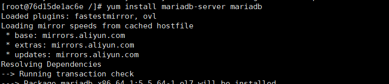
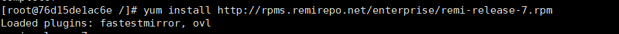

# **实验三 Docker基础实验**

### 班级：2017级软件工程（闽台合作）姓名：黄滨 学号：11607207033

### 1.安装Docker

#### 1.1更新应用程序数据库

#### 1.2**添加Docker官方仓库，安装最新Docker**

#### 1.3**启动Docker**

#### 1.4**设置Docker自启动**

#### 1.5**查看Docker 版本信息**

### 2.完成Docker安装之后加载CentOS镜像

#### 2.1**拉取 Centos 7**

#### 2.2**拉取完毕后查看镜像**

#### 2.3**运行Docker容器**

#### 2.4**查看已启动的容器**

#### 2.5**进入容器前台**

### 3.在Docker的CentOS容器实例中安装WordPress

#### 3.1安装Apache Web服务器

#### 3.1.1**连接ssh后使用yum安装**

#### 3.1.2**安装完成后，启动Apache Web服务器**

#### 3.1.3**设置开机自启**

#### 3.1.4访问服务器公网IP,出现下图代表Apache安装成功

#### 3.2安装MySQL

#### 3.2.1**安装MariaDB**

#### 3.2.2**启动MariaDB**

#### 3.2.3**设置MySQL的root密码**

#### 3.2.4**设置开机自启MariaDB**

#### 3.3安装PHP

#### 3.3.1安装epel-release

#### 3.3.2**因为WordPress需要php5.6以上版本的支持，我们更新到7.2版本仓库**

#### 3.3.3**安装PHP以及php-mysql**

#### 3.3.4**查看安装的php版本**

#### 3.3.5**重启Apache服务器以支持PHP**

#### 3.3.6**为了更好的运行PHP，需要启动PHP附加模块**

#### 3.3.7**重启Apache服务**

#### 3.4安装WordPress以及完成相关配置

#### 3.4.1**登录数据库**

#### 3.4.2**为WordPress创建一个新的数据库**

#### 3.4.3**进入刚创建的数据库**

#### 3.4.4**为WordPress创建一个独立的MySQL用户并授权给数据库访问权限**

#### 3.4.5**刷新MySQL的权限**

#### 3.4.6**安装WordPress**

#### 3.4.7接下来访问服务器公网IP，就能进入WordPress安装的web页

#### 

#### 3.4.8安装完成后即可进入WordPress编辑自己的博客了

### 4.将带有WordPress的CentOS镜像推送到容器仓库

#### 4.1**将容器生成镜像**

#### 4.2**登录Docker**

#### 4.3**推送镜像**

#### 4.4**登录Docker网页查看仓库**

### 5.利用Dockerfile文件创建包含WordPress的镜像

#### 5.1**拉取 Centos 7**

#### 5.2编写Dockerfile

#### 5.3构建内置容器

#### 5.4启动容器

#### 5.5验证安装Apache Web服务器 浏览器输入：http://106.54.76.90:1234/

#### 5.6验证安装MySQL（未完成）

#### 5.7验证安装PHP 浏览器输入：http://106.54.76.90:1234/info.php

#### 5.8验证安装wordpress 浏览器输入：http://106.54.76.90:1234/wp-admin/setup-config.php

