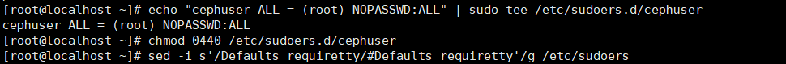
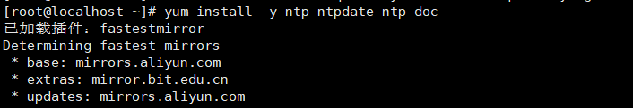
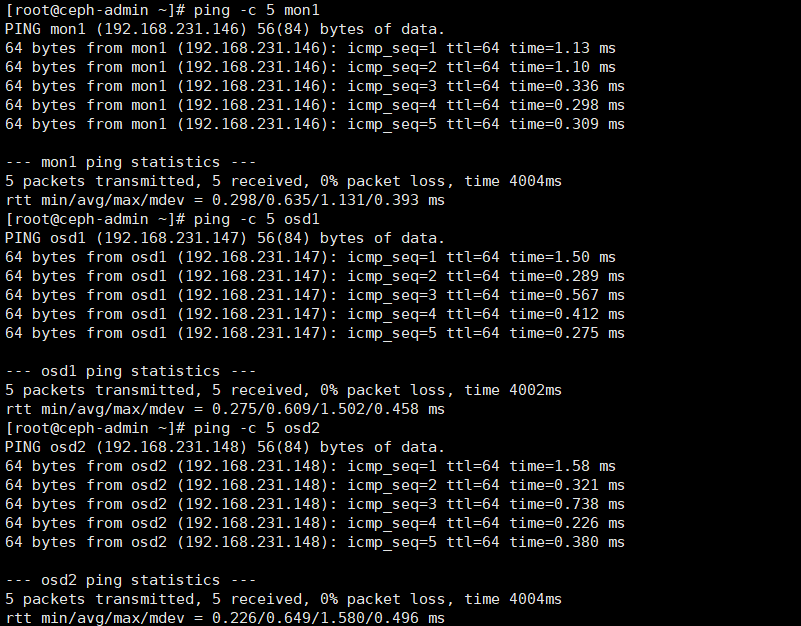
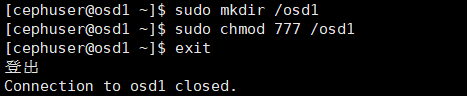

# 实验四 Ceph的安装与实践

### 班级：2017级软件工程（闽台合作）姓名：黄滨 学号：11607207033

### **1.配置所有节点**

#### 1.1创建一个Ceph用户

#### 1.2为用户创建一个sudoers文件，并使用sed编辑/ etc / sudoers文件

#### 1.3安装和配置NTP

#### 1.4安装Open-vm-tools

#### 1.5禁用SELinux

#### 1.6编辑文件network-scripts/ifcfg，设置onboot =“ on”，确保网络通信

#### 1.7克隆虚拟机

#### 1.8配置主机文件，在四台虚拟机上，都要编辑/ etc / hosts文件 

#### 1.9验证四台虚拟机可以互通

### **2.配置SSH服务器**

#### 2.1安装ssh服务器

#### 2.2为“ **cephuser** ” 生成ssh密钥

#### 2.3为ssh配置创建配置文件

#### 2.4更改配置文件的权限

#### 2.5使用ssh-copy-id命令将SSH密钥添加到所有节点

#### 2.6尝试从ceph-admin节点访问各服务器

### **3.配置防火墙**

#### 3.1登录到ceph-admin节点并启动firewall，打开端口80、2003和4505-4506，然后重新加载防火墙

#### 3.2从ceph-admin节点登录到监视节点“ mon1”，然后启动firewalld，在Ceph监视节点上打开新端口，然后重新加载防火墙

#### 3.3打开每个osd节点上的端口6800-7300-osd1，osd2和os3

### 4.构建Ceph集群

#### 4.1添加Ceph存储库，并使用yum命令安装Ceph部署工具' **ceph-deploy** '

#### 4.2创建新的群集目录，使用“ **ceph** **-deploy** ”命令创建一个新的集群配置，将监视节点定义为“ **mon1** ”

#### 4.3编辑ceph.conf文件

#### 4.4从ceph-admin节点在所有其他节点上安装Ceph

#### 4.5将ceph-mon部署在mon1节点上

#### 4.6该命令将创建监视键，并使用“ ceph”命令检查并获取键

#### 4.7登录osd1，osd2，创建供分配的目录，修改权限并返回admin用户

#### 4.8准备所有OSDS节点

#### 4.9激活OSD

#### 4.10得到钥匙圈

#### 4.11为所有决策部署管理密钥

#### 4.12更改密钥文件的权限

### 5.测试Ceph设置

#### 5.1检查集群运行状况，检查集群状态

